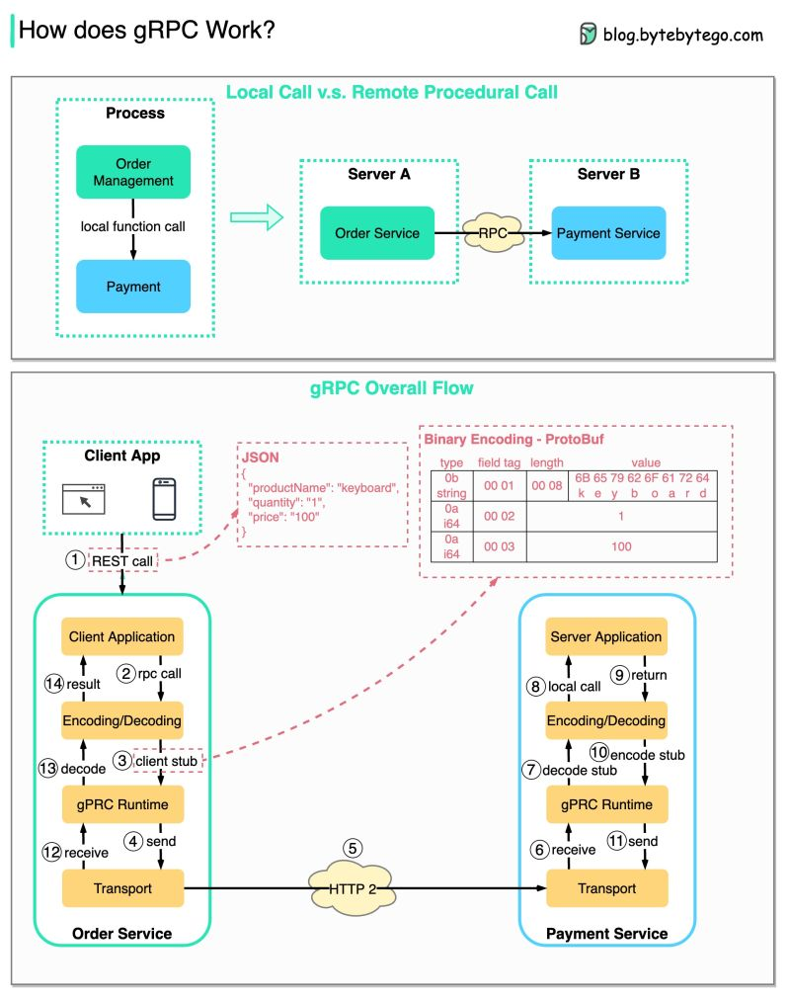

# gRPC

gRPC is a remote procedure call (RPC) framework that uses HTTP/2 for transport
and protobuf. Used to communicate services in a microservices architecture. From
the user's point of view, it acts like a local function call, but instead the
call is executed on a remote server.

## Benefits of gRPC

- Scalability: it uses a binary serialization format (Protocol Buffers), meaning
  smaller message sizes and faster processing times compared to other protocols
  such as json or xml.
- Strong typing: you define the structure and types of the messages in a
  `.proto` file.
- Bi-directional streaming: gRPC supports streaming requests and responses. The
  two streams operate independently, so the client and server can read and write
  in any order.
- Other features: gRPC supports out of the box authentication, deadlines, load
  balancing, service discovery and more.

## How does gRPC work?

The diagram below illustrates the overall data flow for gRPC.

## References

- [gRPC concepts](https://grpc.io/docs/what-is-grpc/core-concepts/)
