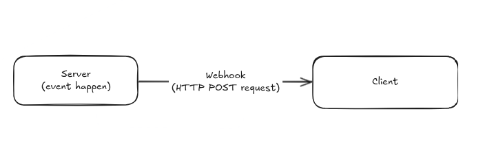

# Webhooks

Webhooks allow to receive information from server to client in real-time. It is
a type of API driven by events instead of requests.

Instead of polling the server for updates, the server can send updates to a
specified URL when certain events occurs. The communication relies on sending
information from server to client via HTTP POST requests, when data is
available.

## When to use webhooks

- **Real-time notification**: server notifies the client immediately when an
  event occurs.
- **Efficiency**: reduces the need for constant polling, saving bandwidth and
  resources.
- **Reaction to events**: useful for triggering workflows or processes in
  response to specific events.

Webhooks should be treated as another endpoint, with the same security and
authentication as any other endpoint.

## Flow

