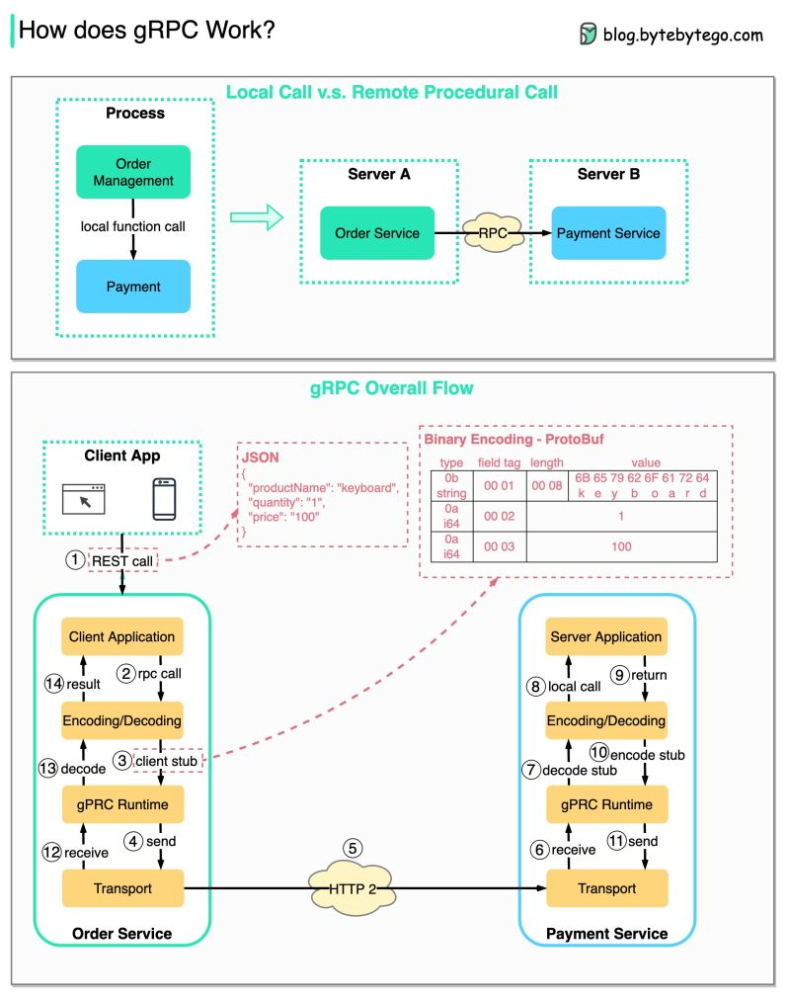

# How does gRPC work?

 RPC (Remote Procedure Call) is called "remote" because it enables
communications between remote services when services are deployed to different
servers under microservice architecture. From the user’s point of view, it acts
like a local function call.

The diagram below illustrates the overall data flow for gRPC.

