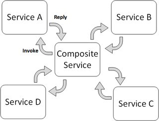
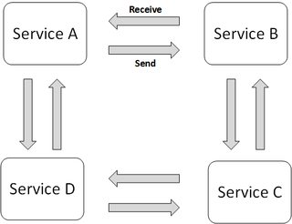

# Microservices

 It is architectural style that focuses on discrete services instead of a
 [monolithic design](../patterns/monolithic.md). Microservices architecture
 breaks down an application into smaller, independent services that each serve a
 specific business capability or function. These services are developed and
 deployed independently, often with their own codebase and database.

## Principles

- Independent development and scaling of individual services. Developers can
  work on small, focused teams, and each service can be scaled independently
  based on its specific requirements and on demand, making resource allocation
  more efficient.

- Each microservice can se different technology stacks and databases for each
  service, depending on the requirements. This flexibility allows you to choose
  the best tool for each job.

- Microservices can be deployed independently, making it easier to implement
  CI/CD pipelines for each service. This results in faster and more frequent
  deployments with less risk.

- More resilient than a monolithic system. If one service fails, it doesn't
  necessarily impact the entire system, as long as other services can continue
  to function.

- Managing the interactions between multiple services can introduce complexity
  in terms of service discovery, communication, and monitoring.

## Orchestration

Orchestration is an approach where one of the services acts as the coordinator
and orchestrator of the overall distributed state change, managing the execution
of tasks or services It defines the order and flow of activities and often
involves a central point of control that dictates what should happen next.

The orchestrator is responsible for making decisions and ensuring that each
component of the system performs its tasks in the prescribed sequence. It can be
simpler to design and implement for relatively small-scale systems with a
limited number of components. However, as the system grows in complexity, the
central orchestrator can become a bottleneck and may make the system less
scalable and more challenging to maintain.

It is easier to implement fault tolerance and error handling because the central
orchestrator can monitor the execution of tasks and react to failures by
rerouting or retrying steps. It also provides a central point for monitoring and
logging, making it easier to track the progress of tasks and diagnose issues.

There is less direct communication between services since most interactions are
mediated by the orchestrator. This can reduce the need for services to be aware
of each other's existence.

## Choreography

Choreography is an approach of service coordination where participants exchange
events without a centralized point of control. With this pattern, each service
performs a local transaction and publishes events that trigger local
transactions in other services. Each component of the system participates in
decision-making about a business transaction's workflow, instead of relying on a
central point of control.

The interaction and coordination between services are determined by a set of
predefined rules or contracts. There is no single point of control, and the
overall behavior of the system emerges from the interactions between the
participating components. It can be more suitable for large-scale and complex
distributed systems because it distributes the decision-making and control among
individual components. As new services are added or existing ones are modified,
the system can remain more flexible and scalable.

However, choreographed systems can be harder to visualize and debug, especially
as the number of interactions between services increases. Also, relies on the
individual services to handle errors and failures gracefully, making it more
challenging to ensure consistent error-handling strategies across the entire
system. It may require more advanced monitoring and tracing tools to gain
insights into the interactions between services and to identify bottlenecks or
errors.

Finally, it requires services to communicate directly with each other, which can
lead to more inter-service communication. This increased communication can
result in more complex service discovery and network traffic management.

## Architecture styles

Services in a microservice architecture needs to communicate between each other.
There are different architectural styles to achieve this communication:

- [REST](../communication/rest.md): Representational State Transfer is an
  architectural style that uses standard HTTP methods (GET, POST, PUT, DELETE)
  to interact with resources. RESTful services are stateless, meaning that each
  request from a client contains all the information needed to process the
  request. REST is simple to understand and implement, and it can be used over
  any protocol that supports request/response semantics.

- RPC: Remote Procedure Call is a protocol that allows a program to execute code
  on a remote server. A popular RPC framework is [gRPC](../communication/grpc.md).

## Patterns

- [API Gateway](../microservices/api-gateway.md)
- [Distributed Transaction](../microservices/distributed-transaction-patterns.md)
- [Event driven](../microservices/event-driven.md)
- [Saga Pattern](../microservices/saga-pattern.md)

## References

- [Orchestration vs choreography](https://www.accionlabs.com/microservices-orchestration-vs-choreography-what-to-prefer)
- [Saga pattern](https://microservices.io/patterns/data/saga.html)
