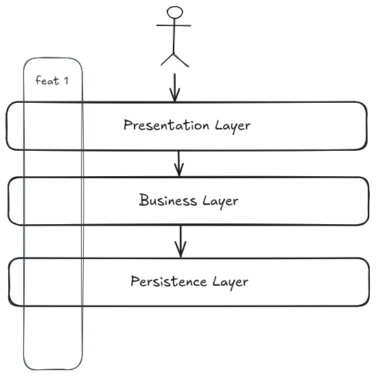
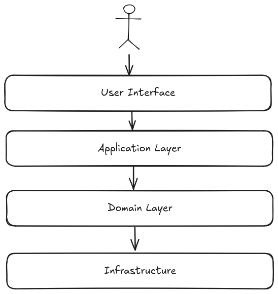
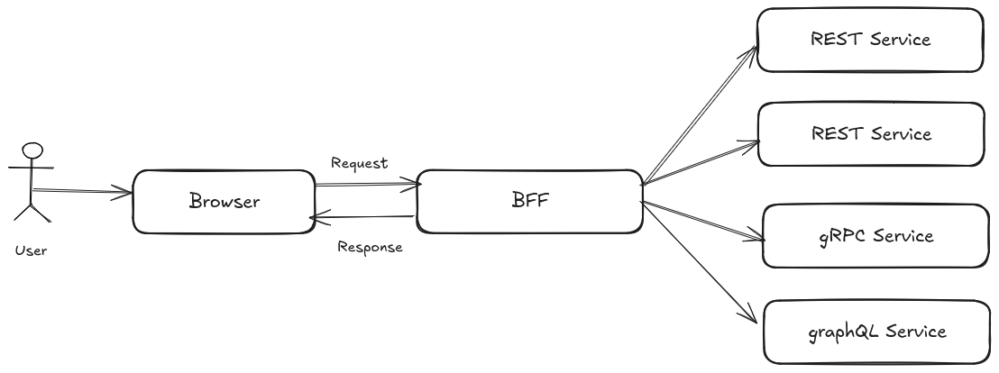

# Architecture patterns

## Vertical slice architecture

Vertical slices architecture isolate all logic of a feature by grouping
functionality together based on workflow or business processes. That means, when
adding or changing a feature in an application, it requires development into
almost all layers in the application.

It is a way of organizing code that is more maintainable and scalable, with
faster delivery times.

## Domain-Driven Design

Domain-Driven Design (DDD) is a software development approach that focuses on
generating a deep understanding of the business domain. It is a way of thinking
and a set of priorities, aimed at accelerating software projects that have to
deal with complex domains. Key concepts of DDD are:

- **Ubiquitous language**: A language structured around the domain model and
  used by all team members to connect all the activities of the team with the
  software.
- **Bounded context**: A boundary within which a particular domain model is
  defined and applicable. It is a way to keep the model clean and focused.
- **Layers**: DDD can be implemented in layers, where the domain model is at the
  center of the architecture.
  - **Presentation layer**: The user interface, responsible to interact with the
    application or user.
  - **Application layer**: orchestrates the domain objects to perform the
    required operations or use cases.
  - **Domain layer**: The core of the application, where the business logic
    resides.
  - **Infrastructure layer**: The external systems that the application
    interacts, like persistence, messaging, etc.

## Hexagonal architecture

Also known as ports and adapters, is a way of organizing code that isolates the
core business logic from the external world. The core business logic is at the
center of the hexagon, and the external world is at the edges.

Two important concepts in hexagonal architecture are ports and adapters:

- **Ports**: Interfaces that define the way the application core interacts with
  the outside world. It can be an input/driving port or an output/driven port.
  Are agnostic to the implementation.
- **Adapters**: Implementations of the ports that connect the application core.
  They are primary/driving adapter when starts an action and secondary/driven
  adapter when represent connections to the backend, reacting to the primary
  adapter.

This gives the flexibility to make changes on the adapters (implementation)
easily. For example you can swap out Oracle or SQL Server, for Mongo or
something else. Or enable easily an additional entry point for a new consumer.
Your business rules are not bound to the any of these changes outside the core.

## BFF (Backend for Frontend)

BFF is a pattern that consists of creating a backend service customized for a
frontend application. Backend is usually a composition of multiple services,
each of them providing different functionalities and supporting different
protocols. The BFF is responsible for aggregating the data from these services
and providing a single endpoint for the frontend specific needs.

Having this intermediate transformation layer between the frontend and the
backend services, provides the following benefits:

- **Performance**: The BFF can aggregate data from multiple services and reduce
  the number of requests made by the frontend.
- **Security**: The BFF can handle authentication and authorization to each
  backend, so frontend can be stateless.
- **Flexibility**: The BFF can be customized for each frontend, providing only
  the data and format needed by the frontend, reducing the payload size.
- **Efficiency**: The BFF can be optimized for the frontend, providing complex
  common business logic to the frontend.
- **Cache**: The BFF can cache data from the backend services, reducing the load
  on the backend services.

## References

- [Hexagonal architecture](https://www.qwan.eu/2020/08/20/hexagonal-architecture.html)
- [Ports and adapters](https://herbertograca.com/2017/09/14/ports-adapters-architecture/#evolving-from-the-layered-architecture)
- [Vertical slice](https://ivanojgarcia.medium.com/vertical-slicing-a-term-for-powerful-hexagonal-architecture-3687fded1925)
- [Backend-for-Frontend](https://blog.bitsrc.io/bff-pattern-backend-for-frontend-an-introduction-e4fa965128bf)
