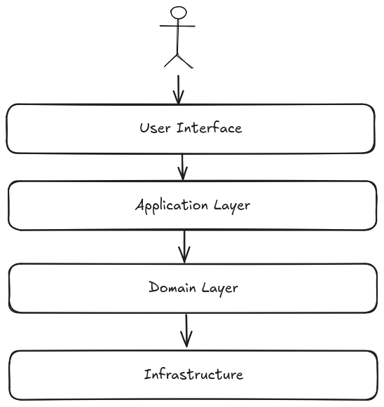

# Domain-Driven Design

Domain-Driven Design (DDD) is a software development approach that focuses on
generating a deep understanding of the business domain. It is a way of thinking
and a set of priorities, aimed at accelerating software projects that have to
deal with complex domains. Key concepts of DDD are:

- **Ubiquitous language**: A language structured around the domain model and
  used by all team members to connect all the activities of the team with the
  software.
- **Bounded context**: A boundary within which a particular domain model is
  defined and applicable. It is a way to keep the model clean and focused.
- **Layers**: DDD can be implemented in layers, where the domain model is at the
  center of the architecture.
  - **Presentation layer**: The user interface, responsible to interact with the
    application or user.
  - **Application layer**: orchestrates the domain objects to perform the
    required operations or use cases.
  - **Domain layer**: The core of the application, where the business logic
    resides.
  - **Infrastructure layer**: The external systems that the application
    interacts, like persistence, messaging, etc.

