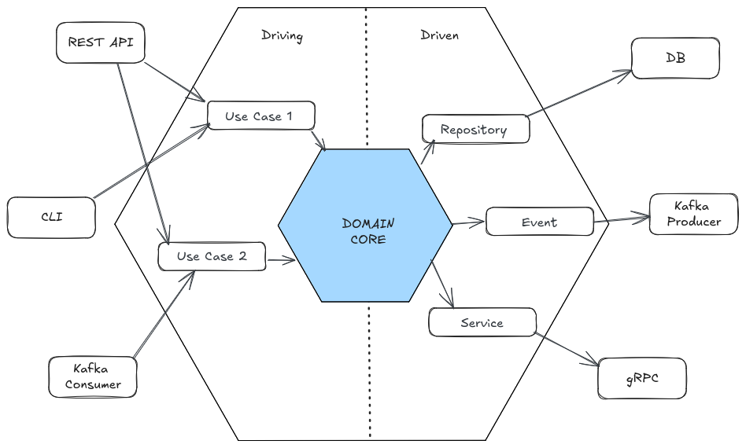

# Hexagonal Architecture

Hexagonal Architecture, also known as Ports and Adapters, it is used in software
design to create a clear separation between the core logic of an application and
its external dependencies (input/output mechanisms).

The business logic doesn't depend in any way on the external dependencies (where
any dependency can be easily replaced without affecting the core logic).

Avoid hexagonal architecture when the application is small or simple, as it can
add unnecessary complexity.

## Key Concepts

- Ports: Interfaces that define how the application interacts with the outside
  world. They are abstractions that allow the core logic to communicate with
  external systems.

- Adapters: Implementations of the ports that connect the core logic to external
  systems. They translate the data and calls between the core logic and the
  external systems.

- Core Logic: The central part of the application that contains the business
  rules and logic. It is independent of any external systems or frameworks.

This gives the flexibility to make changes on the adapters (implementation)
easily. For example you can swap out Oracle or SQL Server, for Mongo or
something else. Or enable easily an additional entry point for a new consumer.
Your business rules are not bound to the any of these changes outside the core.

## Performance

Each adapter gather all code related to a specific external system, allowing
developers to optimize the performance of each adapter independently.

## Benefits

- **Separation of Concerns**: The core logic is isolated from external systems,
  making it easier to maintain and test.
- **Testability**: The core logic can be tested independently of external
  systems, allowing for easier unit testing and mocking of dependencies.
- Developers can work independently on different adapters without affecting the
  core logic.

## References

- [Hexagonal Architecture](https://itnext.io/hexagonal-architecture-fe1250fb52be)
- [Hexagonal architecture](https://www.qwan.eu/2020/08/20/hexagonal-architecture.html)
- [Ports and adapters](https://herbertograca.com/2017/09/14/ports-adapters-architecture/#evolving-from-the-layered-architecture)
