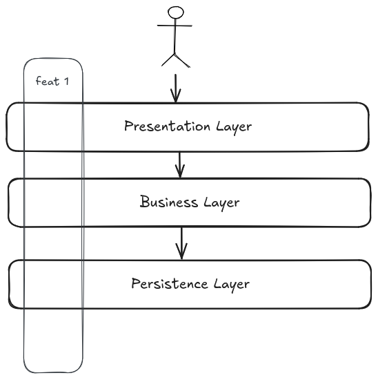

# Vertical slice architecture

Vertical slices architecture isolate all logic of a feature by grouping
functionality together based on workflow or business processes. That means, when
adding or changing a feature in an application, it requires development into
almost all layers in the application.

It is a way of organizing code that is more maintainable and scalable, with
faster delivery times.

## References

- [Vertical slice](https://ivanojgarcia.medium.com/vertical-slicing-a-term-for-powerful-hexagonal-architecture-3687fded1925)
