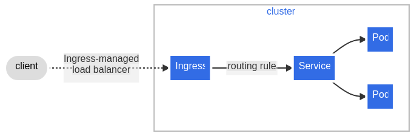

# Kubernetes

It is a high-disponiblity platform. It support different application available
to be consume. You can use `kubectl` (core k8s cli tool) to give instructions to
k8s. Instructions can be imperative and declarative (prefer approach).
Declarative is where k8s take the lead regarding which are the actions needed to
reach the desire state.

**Act -> observe -> diff -> Act**
or
**Desire vs Actual state**

k8s uses reconciliation to make the actual state looks like the desire state via
control loop. Or by using imperative actions.

k8s is usually the deployment tool for a
[microservices](../architecture/microservices/microservices.md) architecture,
instead of [monolithic application](../architecture/patterns/monolithic.md).

## Concepts

Data is send to k8s through a yaml file, which is a declarative way to describe.
Kind is equal to the object being described.
Name must unique within the namespace for each Kind.

spec information regarding this object representation.

Create new or update resource with `kubectl apply -f <file.yaml>`

## Pod

Can be reusable. It is a group of containers. It is the smallest unit in k8s.
All containers for a pod will run in the same mode. They can talk to each other
via localhost, and can share volume resources.

A pod can have a container to run a web server application, where the code is
located inside the image. But any time there is typo or a fix, it needs to build
a new image and restart the container. This is called main container.

Using side containers, we can have a shared volume between the main container to
read the content from, separation od concern isolating and reusing. Each
container can have different resources, like memory, cpu, etc.

## Services

Load balancing for Pods. Use labels to determine target pods. Like a load
balancer in front opf our pods. Service are not process running in k8s, is not
consuming resources, is more like configuration or metadata.

## Deployments

Deployments are an objects in k8s designed to avoid declaring the exact same pod
metadata (except by the name, as it must be unique) when you need to deploy X
instance of the same pod.

Deployments does not create actually any pods, Instead, deployment create an
object in the middle call replica sets.. Replica sets are used to make it easy
to roll from one version of a deployment to another. Each time we update a
deployment, a new replica set is created that contains the latest configuration.
Replica set actually create the pods.

Two type of strategies:

- RollingUpdate: value by default. new ReplicaSet is created, then scaled up as
  old one is scaled down.
- Recreate: remove all existing pods in the existing ReplicaSet before creating
  new ones from new ReplicaSet.

Also, it is possible to configure another different
[deployment strategies](../devops/deployment-strategies.md).

In a deployment, each endpoint is the IP address of a pod that is backing that
service. In case of multiple replicas, we should see 1 endpoint for each pod
created for a deployment.

More configuration available in the official k8s documentation.

## StatefulSet

It is an extension of deployment. It is used to manage stateful applications.
Name is stable, unique pod identifiers and DNS names. Also, possible to set
Persistent Storage and one Persistent Volume per VolumeClaim template. Stick to
pod as long as the pod is declared.

Pods created in asc order and deleted in desc order. It is possible to scale up,
but all pods must be in Running or Read.

## Labels

Characteristics are:

- map of key/value pairs, try to standardize
- both organizational and functional (selector on services)
- indexes and searchable
- avoid compound labels values

## Architecture

- Worker nodes, where the containers are running and application. They have cpu,
  memory to handle the application. Each of the have docker installed and
  **kubelet**, which mainly determine the url of the k8s cluster.
- Control planes nodes: host the components that actually run k8s. like API
  server. Data stored is in etcd. Scheduler, determine where to run the pods.
  Controller manager, watch the state of the cluster and make changes to the
  cluster to match the desire state. Cloud controller manager, manage the
  interaction with the underlying cloud provider.

## Networking

Traffic can happen in a cluster within a pod, pod to pod, service to pods and
external to cluster.

- within a pod: containers within a pod can connect to each other using
  localhost. Containers share an IP address accessible throughout the cluster and
  share common port space.
- pod to pod: each pod has a unique IP address, so they can communicate with
  each other. IP address are routable anywhere within the cluster. Not common
  procedure.
- service to pod: service is a resource that provides layer-4 load balancing for
  a group of pods. Service discovery using the cluster's internal DNS. Types are:
    - ClusterIP (virtual IP address that load balance request to backend pods,
  accessible only in the cluster).
    - NodePort: used for external facing service, exposing a port to access
    externally. K8s will open the port in each worker node.
- external to cluster: service type LoadBalancer, external IP address is
  provisioned by the cloud provider. Creates and manages an external load
  balancer, managing traffic across all nodes.

Another option is **Ingress**. It is a layer-7 load balancer. It is a resource
that balance the traffic for one or more services. Ingress rules to balance
traffic to specific service. An Ingress may be configured to give Services
externally-reachable URLs, load balance traffic, terminate SSL / TLS, and offer
name-based virtual hosting. An Ingress controller is responsible for fulfilling
the Ingress, usually with a load balancer, though it may also configure your
edge router or additional frontends to help handle the traffic. Same rules as
Nginx or Traefik can be applied to Ingress, meaning that traffic to a domain or
a specific path can be redirect to the corresponding labelled service.

## Resource organization

Have multiple clusters, to have highest level of isolation. Each cluster can
have different purposes, like security, environments (development vs uat vs
production), by geography...

Namespaces are a grouping in k8s. There is no nesting, all our objects in k8s go
to same namespace. Namespaces are a way to organize and isolate resources. Names
of resources must be unique within a namespace. Security and access can be set
per namespaces. Usually 1 namespace per project.

## kubeconfig

It a file that contains all sections for k8s.

- clusters: url of the API service. Name can be use later for the kubeconfig
  file.
- context: where cluster, user and name are glue together. Names are used to
  identify the context.
- users: credentials to use to access the cluster. Name can be use later for the
  kubec config file.

## Volume

It is a way to persist data. It is a directory that is accessible to containers.
Volumes are exposed at pod level. By default, containers in a pod write to
ephemeral storage (emptyDir), only available during the pod's lifecycle. Once
pod is terminated, data is lost.

But we can attach Persistent volumes to pods which persist any data written to
them. They are network attached storage, independent of pod's life. We can
static or dynamic volumes. Static volumes are created manually, dynamic volumes
are created automatically when a pod is created. Storage is actually outside the
cluster.

I your k8s manifest, you will define what are your needs with a Persist Volume
Claim. Then, when the request reaches the cluster, it will be matched with a
Persist Volume (binding). If there is no match, it will create a new one.

## Secrets and dynamic configuration

All runtime configuration should be able to be injected and overrides. Defaults
are ok, but we should be able to override them. Secrets are a way to store
sensitive information, like passwords, tokens, keys... They are stored in etcd,
encrypted at rest. They are base64 encoded, but not encrypted. We can either
provide defaults value if no configuration is provided or required
configuration, where startup fails if no configuration is provided.

ConfigMap is the object to store configuration. It is a key/value pair. Use to
store configuration data and properties. We can load all keys
(envFrom.configMapRef) or individual keys (env.valueFrom.configMapKeyRef) as
environment variables. Another option is to mount the config map as a mounted
volume, similar all keys or individual keys (changes don´t require
restart).

For sensitive information, Secret resource stores this kind of data. Must be
Base64 encode, and they can be exposed to pod via environment variables or
mounted volumes (optional, other secret mechanism system).

## Network policies

Specification of how groups of pods are allowed to communicate with each other
or other network endpoints. Use of labels to select pods and define rules which
specify what traffic is allowed to the selected pods.

By default, traffic is allowed by default. A pod become isolated when defining a
network policy that selects them in the namespace. Other pods within the
namespace will continue to receive traffic, unless a network policy is defined
for them.

## Workloads

A Job is a resource that runs to completion, ensure it completes or retries.
Based on pod, and job and pod resources will remain so logs, output can be
reviewed. Manually clean up actions are required. Possible to create parallel
jobs too. Use cases are batch processing, data migration, backups, etc. some
process that require large amount of data to process.

Also, another interesting resource is Cronjobs. Schedules one or repeated a
specific time or interval. It is based on job, so it is a pod. It is a way to
automate recurrent tasks. New Job resources are created for each run. By
default, it will clean up Jobs, by default, keeping 3 successful and 1 failed
jobs. Jobs should be idempotent.

DaemonSet is a resources that ensures that all nodes run a copy of a pod.
Usually used for cluster-wide logging and monitor agents.

## Security context

To give a more restrictive access to the pod. It is a way to limit access of
the users.

## Service account

A service account provides an identity for processes that run in a Pod, and maps
to a ServiceAccount object. When you authenticate to the API server, you
identify yourself as a particular user. There is a service account by default.

## Role-based access control

Once a user is authenticated, we need to authorize the user to perform actions.

a Role is a collection of permissions (rules). Roles **are namespace specific**.
We can assign rules to groups, and users belongs to groups. A more flexible way
to assign rules.

With ClusterRole, we can assign rules to cluster-wide resources instead to
restrict to a specific namespaces. Totally reusable across entire cluster.

We assign to groups and user with RoleBinding object. It is namespace specific.
Get subjects and roles, and bind them together. Similar, but for entire cluster,
you have the object ClusterRoleBinding.

There are some built-in roles, such as `cluster-admin`, `admin`, `view` and
`edit`.

## Local k8s cluster

minikube quickly sets up a local Kubernetes cluster on macOS, Linux, and
Windows. Easy to install and start working.

Install and run minikube to have a local cluster for k8s in local. If minikube
is running, automatically context/namespace is updated to use then one's from
minikube. If you are working with other k8s cluster, keep in mind this change.
Always double-check for namespace or context before deploying to the cluster. To
work with cluster outside local, either you stop minikube or change namespace.
Careful, when you stop minikube, context/namespace are set to null, so your kube
commands won't be pointing to any context. You need to explicitly set again
context.

`minikube` command is just a proxy of `kubectl` commands, with a different
command format but doing the same underneath.

## Readiness and liveness, startup probes

Kubernetes simply observes the pod's lifecycle and starts to route traffic to
the pod when the containers move from the Pending to Succeeded state. That
means, Kubernetes mark a pod as healthy and ready to get request as soon as this
happens. But application may receive traffic before is actually ready, because
it needs to make database connection or load some data. There is a gap between
when the app is ready and when Kubernetes thinks is ready. Risk of receive
traffic and return 500 errors. Similar case happens when Kubelet watches for
application crashes and restarts the pod to recover.

3 different probes:

- Liveness probe, determines the health, and kills the pod if it fails the
  liveness check (deadlock situation, since the underlying process continues to
  run from Kubernetes's perspective).
- Readiness probes are used to let kubelet know when the application is ready to
  accept new traffic. It runs during the pod's entire lifecycle, to deal when
  the application is temporarily unavailable (wait for it to recover).
- Startup probes are similar to readiness probes but only executed at startup.
  They are optimized for slow starting containers or applications with
  unpredictable initialization processes.

3 different probe handlers:

- exec: run a command inside the container. Success if return code is 0.
- TCPSocket: TCP check , success if port is open and accepting connections.
- HTTPGet: invoke HTTP GET against url, success if 2XX or 3XX code.

There are many options in the probe configuration, check in the official k8s
documentation.

## Resource management

Units in k8s have a different rate conversion, and different units for CPU and
Memory (can be either base 2 or 10).

Resource request is the minimum amount of resources that the container needs to
work. Helps k8s to schedule the pod in a more efficient way. Only used for
scheduling, if the sum of the resource requests less than the capacity of the
node.

On the other hand, we have resource limits. It is the maximum amount of
resources that a pod can get. If exceed this limits, container might be
terminated. It is a way to protect against a runaway app.

## References

- [K8s courses](https://kube.academy/courses)
- [k8s concepts](https://kubernetes.io/docs/concepts/)
- [k9s commands](https://gist.github.com/McLargo/ae633d1ff481c20c21433074169d283c#file-k9s-md)
- [minikube handbook](https://minikube.sigs.k8s.io/docs/handbook/)
- [minikube/kubectl commands](https://gist.github.com/McLargo/ae633d1ff481c20c21433074169d283c#file-minikube-md)
- [kubernetes probes](https://blog.devgenius.io/understanding-kubernetes-probes-5daaff67599a)
- [liveness probes tips](https://srcco.de/posts/kubernetes-liveness-probes-are-dangerous.html)
